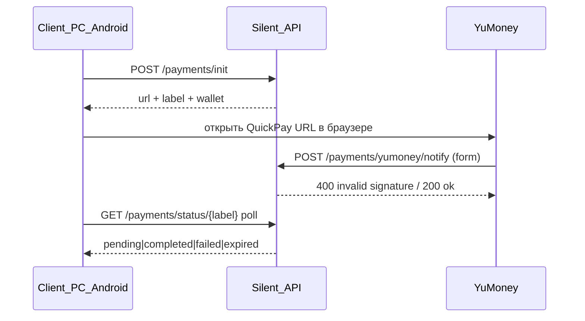

# APIS — Silent VPN

Все endpoint'ы, внешние сервисы и переменные окружения проекта.
**Секреты не хранятся в этом файле** — только имена переменных и расположение.

---

## Production URLs

| Сервис | URL |
|--------|-----|
| HTTPS API | `https://132-243-234-162.nip.io` |
| VPS IP | `132.243.234.162` |
| WDTT (UDP) | `132.243.234.162:56000` |
| WireGuard (UDP) | `132.243.234.162:56001` |
| Tunnel API (через WG) | `http://10.66.66.1:8000` |
| wdtt-server binary | `https://github.com/amurcanov/proxy-turn-vk-android/releases/latest/download/wdtt-server-linux-amd64` |
| GitHub repo | `https://github.com/footballpredictions/Silent.git` |
| **Landing (скачивание)** | `https://silentvpn3.github.io` → репо [`silentvpn3/silentvpn3.github.io`](https://github.com/silentvpn3/silentvpn3.github.io) (**отдельный** от Silent). Файлы — **GitHub Releases** (`v1.0.x`), fallback `releases.json` на Pages |

---

## Backend API

**Базовый префикс:** `/api`  
**Health:** `/health`, `/api/health`  
**Авторизация пользователя:** `Authorization: Bearer <access_token>`  
**Админка:** `Authorization: Bearer <admin_token>` (от `POST /api/auth/admin/login`)  
**S2S (wdtt-server):** `X-Internal-Secret: <INTERNAL_API_SECRET>`

### Auth — `/api/auth`

| Метод | Путь | Auth | Описание |
|-------|------|------|----------|
| POST | `/register` | — | Регистрация `{ email, password, referral_or_promo? }`. Поле — либо реф-код пользователя, либо промокод (взаимоисключающе). Реф → `referred_by` + `ReferralReward(pending)`; промо → `pending_promo_code` (скидка при `/payments/init`). При `app_settings.registration_disabled=true` → **503** «Ведутся технические работы. Регистрация временно недоступна.» (админка «Доп. настройки»). Анти-абуз: **429** при >`REGISTER_RATE_LIMIT_MAX` попыток с одного IP за `REGISTER_RATE_LIMIT_WINDOW_MINUTES` (Redis fixed-window, fail-open без Redis); **400** если: hard-block анонимайзеров (`internet.ru`, Apple Hide My Email, Duck/Firefox Relay…), disposable-домен, `+alias`, или домен не в `ALLOWED_EMAIL_DOMAINS` (whitelist; `internet.ru` убран — Mail.ru анонимайзер). Gmail uniqueness по canonical (точки/googlemail). См. `email_validation.py`. Дополнительно: один trial на `device_fingerprint` (`require_device_trial_not_reused` в `/vpn/device/register`) — алиасы Mail.ru на одном устройстве не плодят бесплатный VPN |
| GET | `/verify-email?token=` | — | HTML-подтверждение email |
| POST | `/login` | — | JWT access + refresh; опционально `device` → ensure_device_session |
| POST | `/refresh` | — | Обновление токенов |
| POST | `/forgot-password` | — | Письмо сброса пароля |
| POST | `/reset-password` | — | Смена пароля по токену |
| GET | `/app-reset?token=` | — | Редирект на web form сброса пароля |
| GET | `/reset-password-page?token=` | — | HTML-форма смены пароля |
| POST | `/admin/login` | — | Пароль + опц. `device_token`; при новом устройстве `requires_mfa` + код на `ADMIN_MFA_EMAIL` (TTL 2 мин, `mfa_ttl_seconds`) |
| POST | `/admin/mfa/verify` | — | Код из письма → JWT + опц. `device_token` (trusted device) |
| POST | `/admin/mfa/resend` | — | После истечения TTL — новый код; body `{ challenge_id }` → новый `challenge_id` |
| POST | `/resend-verification` | — | Повторная отправка письма верификации |

### VK Auth — `/api/auth/vk` (на сервере)

| Метод | Путь | Auth | Описание |
|-------|------|------|----------|
| POST | `/link/attach` | User | Привязка VK к аккаунту |
| POST | `/guest/link/start` | — | Гостевая привязка VK |
| GET | `/callback?code&state` | — | OAuth callback |
| GET | `/status` | User | Статус VK-привязки |

### Users — `/api/users`

| Метод | Путь | Auth | Описание |
|-------|------|------|----------|
| GET | `/me` | User | Профиль, подписка, устройства, лимиты |
| GET | `/me/referral` | User | Реф-код, `silentvpn://ref?code=…`, счётчики invited/rewarded/pending |
| POST | `/logout` | User | Выход: end_device_session по fingerprint |
| POST | `/change-password` | User | Смена пароля (авторизован) |
| PATCH | `/devices/{device_id}` | User | Переименование устройства |
| DELETE | `/devices/{device_id}` | User | Удаление сессии устройства |

### VPN — `/api/vpn`

| Метод | Путь | Auth | Описание |
|-------|------|------|----------|
| POST | `/bootstrap-config` | — | Pre-login VPN (bootstrap hash) |
| POST | `/device/register` | User | Регистрация устройства + WG-конфиг |
| GET | `/config?fingerprint=` | User | Свежий конфиг для устройства |
| GET | `/hashes` | User | VK-хеши (bootstrap + server slots) |
| POST | `/hashes/request-refresh` | User | Запрос серверных хешов |
| POST | `/hashes/report-failure` | User | Отчёт о сбое hash/tunnel |
| POST | `/connect` | User | VPN on, лимит одновременных подключений |
| POST | `/disconnect` | User | VPN off (сессия остаётся) |
| POST | `/internal/online` | S2S | Keepalive от wdtt-server |
| GET | `/internal/threat-filter` | S2S | Хост sync DNAT: `{ enabled }` (`X-Internal-Secret`) |
| POST | `/internal/threat-filter/meta` | S2S | Хост updater: `{ domains_count, list_updated_at }` после скачивания HaGeZi TIF |
| GET | `/internal/vps-cleanup` | S2S | Хост cleaner: `{ enabled, interval_days, journal_max_mb, run_now, last_run_at }` |
| POST | `/internal/vps-cleanup/meta` | S2S | Хост cleaner: `{ summary }` после прогона (сбрасывает `run_now`) |
| POST | `/exclusions` | User | Исключения приложений (Android) |
| GET | `/exclusions/{device_id}` | User | Получить исключения |
| GET | `/theme` | — | **Публичная** тема UI (`ThemeResponse`) |
| GET | `/olcrtc-config` | — | **Публичный** конфиг варианта 2 (olcrtc) для debug-клиентов |
| GET | `/sync-state` | User | ConfigSync: ревизии theme/profile/hashes |
| POST | `/reachability-report` | User | Репорт клиента об отказе подключения (rate limit по IP) — вход агента доступности |

**reachability-report body** (обязателен только `stage`; старые клиенты эндпоинт не вызывают):

```json
{
  "stage": "dns|tcp|tls|handshake|tunnel_dead|api",
  "transport": "udp|tcp|olcrtc",
  "network_type": "wifi|mobile|ethernet|offline",
  "carrier": "MTS",
  "server_slot": "server1",
  "tunnel_uptime_sec": 4,
  "platform": "android|pc|ios",
  "app_version": "1.0.161",
  "detail": "timeout",
  "age_sec": 0
}
```

Ответ: `{ "ok": true, "accepted": true }`. `accepted: false` — сработал rate limit
(`detail: too many reports`) или репорт старше срока хранения (`detail: stale report`).

**Про `age_sec`.** Отказ и означает, что отправить сразу не вышло: клиент кладёт репорт
в очередь и досылает, когда канал появится (main VPN, сота `:9100`, bootstrap-туннель).
`age_sec` — сколько репорт пролежал; сервер метит запись временем **самого отказа**
(`now − age_sec`), иначе отложенная пачка попала бы в текущее окно агрегации и агент
увидел бы блокировку, которой уже нет. Репорт старше 48 ч отбрасывается.
Поле опционально: без него репорт считается свежим (поведение старых клиентов).

**Как репорт доходит при блокировке.** Прямой путь до Улья не единственный: путь
`vpn/*` входит в белый список публичного failover соты (`is_public_failover_path`),
и сота проксирует запрос на Улей — у неё другой IP и порт `9100`. Плюс bootstrap-туннель
по VK-хешу. Полный blackhole клиентская телеметрия не покрывает, но его и так видят
российские ноды `check-host`.

**sync-state query params:**

```
GET /api/vpn/sync-state?hashes_since=0&theme_since=0&profile_since=0
```

### Payments — `/api/payments` (на сервере, кастомный YuMoney QuickPay, без API YuMoney)

Единый флоу для **всех** клиентов (PC/Android/iOS): `POST /init` → открыть `url` в системном браузере (не WebView, не проксируется через бекенд) → `GET /status/{label}` poll каждые ~4с до `completed`/`failed`/`expired` или таймаута (10 мин). Реализация: `app/services/payment_service.py`, план: `.cursor/PLAN_PAYMENTS_YUMONEY.md` (реализован + покрыт тестами `scripts/test_payment_unit.py`, 37/37 OK).

| Метод | Путь | Auth | Описание |
|-------|------|------|----------|
| POST | `/init` | User | `{ plan_type, promo_code? }` → `{ url, wallet, label, amount }`. `label` — `silent_<32 hex>` (высокая энтропия, `secrets.token_hex(16)`), кошелёк выбирается случайно из настроенных `YUMONEY_WALLET_1..10`. `url` — прямая ссылка `yoomoney.ru/quickpay/confirm.xml` (urlencoded), клиент открывает её во внешнем браузере как есть. Если `promo_code` пуст — берётся `user.pending_promo_code` (снимается только при успешной оплате, не здесь) |
| GET | `/status/{label}` | User | Poll для клиента: `{ label, status, plan_type, amount }`, `status` = `pending`/`completed`/`failed`/`expired`. Только свои платежи (по `user_id`) — 404 на чужой label. `pending` дольше `YUMONEY_PAYMENT_TTL_MINUTES` (30) лениво помечается `expired` |
| POST | `/promo/check` | User | Проверка промокода |
| GET | `/plans` | — | Магазин: monthly / two_months / quarterly |
| GET | `/success-page` | — | Публичная HTML-страница — `successURL` в QuickPay-ссылке; куда YuMoney возвращает браузер после оплаты. Не источник правды — активацию клиент узнаёт через poll `/status/{label}` |
| POST | `/yumoney/notify` | YuMoney (HTTP-уведомление) | Webhook — см. **YuMoney webhook flow** ниже |

#### YuMoney webhook flow (`POST /api/payments/yumoney/notify`)

Источник правды об оплате — **только** этот webhook (не `success-page`, не клиентский poll). Код: `app/api/payments.py` → `process_payment_notification` в `app/services/payment_service.py`.



1. **Кабинет YuMoney (каждый кошелёк):** «Настройки для разработчиков» → HTTP-уведомления → URL `https://132-243-234-162.nip.io/api/payments/yumoney/notify` → секрет → `YUMONEY_SECRET_N` в `.env` (пара к `YUMONEY_WALLET_N`).
2. **Тело:** `application/x-www-form-urlencoded` (form). Ключевые поля: `label`, `operation_id`, `amount` / `withdraw_amount`, `currency`, `codepro`, `unaccepted`, подпись `sign` (с 2026-05-18) или legacy `sha1_hash`.
3. **Подпись:** `_verify_yumoney_sign` — HMAC-SHA256 по всем параметрам **кроме** `sign`, ключи A–Z, значения URL-encoded (RFC 3986), секрет кошелька. Fallback: старый `sha1_hash`. Секрет берётся от **кошелька платежа** (`Payment.wallet` → `YUMONEY_SECRET_N`), не «любой из списка» после нахождения payment; до нахождения — проверка «хоть один кошелёк» для отсечения мусора.
4. **Блокировка строки:** `SELECT … FOR UPDATE` по `Payment` где `label=…`.
5. **Чеклист отказа (payment → `failed` или ignore, ответ всё равно 200 если подпись валидна):** `codepro=true`, `unaccepted=true`, `currency≠643`, сумма `< expected * YUMONEY_AMOUNT_TOLERANCE` (0.93) — защита от `sum=1`.
6. **Идемпотентность:** повтор с тем же `operation_id` → 200, без повторной активации подписки.
7. **Успех:** `Payment.status=completed` → активная `Subscription` по `plan_type` → `PromoCode.use_count += 1` + очистка `pending_promo_code` → реферальный бонус (если есть) → email.
8. **HTTP-коды наружу:**
   - **400** — только `invalid signature` (YuMoney **не** должен считать доставленным; иначе можно «подтвердить» подделку ретраями).
   - **200** `{status:ok, reason:…}` — подпись ок (в т.ч. duplicate / already completed / amount mismatch уже записан) — чтобы не было бесконечных ретраев.
9. **Клиент:** после оплаты poll `GET /status/{label}` ~каждые 4 с до 10 мин; `success-page` — только UX возврата браузера, не активация.
10. **Тесты:** `backend/scripts/test_payment_unit.py` (подпись `sign`/`sha1_hash`, commission, sum=1, идемпотентность).

**Реферальная программа**

- Deep link: `silentvpn://ref?code=<REFERRAL_CODE>`
- Награда: после первой оплаты invitee — +`REFERRAL_BONUS_DAYS` (30) обоим; один бонус на invitee; самоприглашение запрещено
- Антиабуз: не более `REFERRAL_MONTHLY_REWARD_LIMIT` (10) наград inviter за скользящие 30 дней — invitee всё равно получает бонус, inviter нет
- Growth-фаза до ~1000 пользователей; условия могут ужесточиться (см. MEMORY_BANK → Реферальная политика)
- Раздел клиентов «Бонусы»: реф-ссылка + проверка промокода
- Theme-поля: `menu_bonuses_label`, `bonuses_*`, `register_referral_or_promo_*` (в `bonuses_rules_text` — лимит и «условия могут измениться»)
- `GET /users/me/referral` также отдаёт `monthly_reward_limit`, `rewarded_last_30_days`

### Updates — `/api/updates`

| Метод | Путь | Auth | Описание |
|-------|------|------|----------|
| GET | `/check?platform=pc\|android\|linux&version=` | — | OTA: доступность обновления |

### Admin — `/api/admin`

Админ UI/API: `Host: ADMIN_PUBLIC_HOST` (nip.io) **или** `Host: 10.66.66.1` (VPN tunnel — PC открывает админку при включённом VPN без bypass). Сырой публичный IP / чужой Host → 404. JWT админки содержит `jti` серверной сессии (отзыв через DELETE).

| Метод | Путь | Auth | Описание |
|-------|------|------|----------|
| GET | `/sessions` | Admin | Активные сессии + trusted devices |
| DELETE | `/sessions/{id}` | Admin | Отозвать сессию (+ устройство) |
| DELETE | `/devices/{id}` | Admin | Отозвать trusted device и его сессии |
| GET | `/stats` | Admin | CPU/RAM/disk, users (`connected_devices`, `peak_online_devices`, `peak_online_at`), VK hashes; `vk_users[].created_at` |
| GET | `/users` | Admin | Список пользователей (`is_online`, `online_devices` — опционально) |
| POST | `/users/{id}/grant-subscription` | Admin | Выдача подписки |
| POST | `/users/{id}/revoke-subscription` | Admin | Отзыв подписки |
| POST | `/users/{id}/ban` | Admin | Ban/unban |
| POST | `/users/{id}/verify` | Admin | Ручная верификация email |
| DELETE | `/users/{id}` | Admin | Удаление пользователя + каскад |
| GET | `/vk/status` | Admin | Статус VK-агента |
| POST | `/vk/bot-auth/start` | Admin | OAuth для AI-агента |
| POST | `/vk/bot-auth/paste` | Admin | Вставка OAuth URL |
| POST | `/vk/oauth/finish` | Admin | Android token → сервер |
| GET | `/vk/oauth/callback` | — | Code exchange fallback |
| POST | `/vk/bot-auth/password` | Admin | Password grant |
| GET | `/vk/bot-auth/status?state=` | Admin | Poll OAuth сессии |
| POST | `/vk/agent/connect` | Admin | Запуск VkManager, heal hashes |
| POST | `/vk/agent/sync-env` | Admin | Перечитать VK_AGENT_ACCESS_TOKEN |
| POST | `/vk/agent/disconnect` | Admin | Отключить AI-агент |
| GET | `/vk/hashes` | Admin | Список хешов |
| POST | `/vk/hashes/manual` | Admin | Ручное добавление хеша |
| DELETE | `/vk/hashes/{slot}` | Admin | Удаление слота |
| POST | `/vk/publish-configs` | Admin | Push конфигов в VK |
| POST | `/maintenance/cleanup-bootstrap` | Admin | Удалить bootstrap user |
| GET | `/theme` | Admin | Чтение темы |
| POST | `/theme` | Admin | Запись темы |
| GET | `/settings/registration` | Admin | Флаг `registration_disabled` + текст для клиентов |
| POST | `/settings/registration` | Admin | Body `{ disabled: bool }` — вкл/выкл регистрацию (инциденты/техработы) |
| GET | `/settings/threat-filter` | Admin | DNS-фильтр угроз: `enabled`, `wg_dns`, `domains_count`, `list_updated_at` (HaGeZi TIF) |
| POST | `/settings/threat-filter` | Admin | Body `{ enabled: bool }` — вкл/выкл; клиентам нужен reconnect для нового DNS |
| GET | `/settings/vps-cleanup` | Admin | Автоочистка Улья: `enabled`, `interval_days`, `journal_max_mb`, `last_run_*` |
| POST | `/settings/vps-cleanup` | Admin | Body `{ enabled, interval_days?, journal_max_mb?, run_now? }` — вкл + расписание; при первом вкл. ставит `run_now` |
| GET | `/bypass/olcrtc` | Admin | Настройки olcrtc (вариант 2); `providers.*.rooms[]` пул pc/android |
| PUT | `/bypass/olcrtc` | Admin | Сохранить настройки olcrtc |
| POST | `/bypass/olcrtc/generate-key` | Admin | Новый crypto.key |
| GET | `/bypass/olcrtc/server-yaml` | Admin | Превью server.yaml (+ files pc/android) |
| POST | `/bypass/olcrtc/apply` | Admin | Записать yaml в `update/olcrtc/` для deploy |
| GET/PUT | `/bypass/olcrtc/room-agent` | Admin | Отдельный агент комнат WB/Telemost (не VK) |
| POST | `/bypass/olcrtc/room-agent/run` | Admin | Создать недостающие комнаты сейчас |
| PUT | `/bypass/olcrtc/room-accounts` | Admin | Playwright storage_state аккаунтов (без рандом-рег) |
| POST | `/promo` | Admin | Создание промокода |
| GET | `/promo` | Admin | Список промокодов |
| GET | `/logs` | Admin | Буфер логов |
| GET | `/updates` | Admin | Манифесты PC (Windows) / Android / PC (Linux) в `update/` |
| POST | `/updates/upload` | Admin | Загрузить .exe / .apk / .deb (.AppImage) |
| DELETE | `/updates/{platform}` | Admin | Удалить обновление |
| POST | `/updates/build/{platform}` | Admin | Сборка на сервере → `update/` |
| POST | `/updates/publish-github/{platform}` | Admin | GitHub Release + `releases.json` на silentvpn3.github.io |
| POST | `/updates/publish-github` | Admin | Опубликовать все доступные платформы |
| GET | `/updates/github-status` | Admin | `GITHUB_TOKEN` настроен? |

### Admin Hive — `/api/admin/hive`

| Метод | Путь | Auth | Описание |
|-------|------|------|----------|
| GET | `/cells` | Admin | Список сот + онлайн VPN, CPU/RAM |
| GET | `/summary` | Admin | Сводка: нагрузка Улья, пороги, режим балансировки |
| POST | `/cells/auto` | Admin | Подключить соту (IP + SSH root) — provisoning в фоне |
| POST | `/cells/manual` | Admin | Ручное добавление (без SSH) |
| POST | `/cells/connect` | Admin | Подключить через cell-agent URL + пароль |
| POST | `/cells/{id}/probe` | Admin | Проверка cell-agent |
| POST | `/cells/{id}/upgrade-agent` | Admin | Обновить cell-agent на соте (body: SSH password) |
| PATCH | `/cells/{id}` | Admin | Имя, priority, status (`active` / `draining` / `offline`) |
| DELETE | `/cells/{id}` | Admin | Удалить соту (`?force=true` для provisioning/error) |
| GET | `/availability` | Admin | Последний отчёт агента доступности + настройки + `running` |
| GET | `/availability/history?limit=N` | Admin | История прогонов (`ts`, `status`, `summary`) |
| GET | `/availability/knowledge` | Admin | Справочник методов блокировок РФ + решения |
| POST | `/availability/run` | Admin | Проверить сейчас (409, если прогон уже идёт) |
| PUT | `/availability/settings` | Admin | `enabled`, `external_enabled`, `interval_sec`, `ru_nodes`, `world_nodes` |

**cell-agent на соте** (порт 9100, заголовок `X-Cell-Agent-Secret`):

| Метод | Путь | Описание |
|-------|------|----------|
| GET | `/health` | Health |
| POST | `/v1/handshake` | Параметры VPN для Улья |
| GET | `/v1/status` | CPU/RAM, wdtt_active |
| POST | `/v1/net-probe` | Пробы TCP/UDP с соты (агент доступности): `{ targets: [{ name, host, port, proto }], timeout_sec }` — только чтение |

**Env Hive:** `HIVE_CPU_PERCENT_THRESHOLD`, `HIVE_MEM_PERCENT_THRESHOLD`, `HIVE_CELL_AGENT_PORT`, `HIVE_PROVISION_SSH_USER`, `HIVE_PROVISION_STALE_MINUTES`, `HOST_PROC_ROOT` (опц. `/host/proc`).

### Статические маршруты

| Путь | Описание |
|------|----------|
| `/dashboard` | Admin UI (React SPA) |
| `/subscriptions` | Страница подписок (admin-ui) |
| `/update/pc/{filename}` | OTA PC installer |
| `/update/android/{filename}` | OTA Android APK |
| `/static/vk-agent-oauth.html` | OAuth helper page |

---

## ThemeResponse — поля server-driven UI

Endpoint: `GET /api/vpn/theme` (публичный, без auth).

| Поле | Назначение |
|------|------------|
| `background_color` | Фон |
| **text_color** | Текст |
| `toggle_on_color` / `toggle_off_color` | Тумблер VPN |
| `font_family` | Шрифт |
| `app_name` | Название приложения |
| `update_bar_background_color` | OTA bar — фон |
| `update_bar_text_color` | OTA bar — текст |
| `update_bar_progress_color` | OTA bar — progress |
| `update_bar_label_available` | «Доступно обновление» |
| `update_bar_label_downloading` | «Скачивание…» |
| `login_step1_title` | Заголовок шага 1 (bootstrap hash) |
| `login_step1_instruction` | Инструкция шага 1 |
| `login_hash_placeholder` | Placeholder хеша |
| `login_hash_button_text` | Кнопка «Подключить» |
| `login_vk_mobile_url` / `login_vk_mobile_link_text` | Ссылка VK (mobile) |
| `login_vk_pc_url` / `login_vk_pc_link_text` | Ссылка VK (PC) |
| `login_link_color` | Цвет ссылок |
| `login_step2_title` | Заголовок шага 2 (login) |
| `login_remember_me_label` | «Запомнить меня» |
| `login_forgot_password_label` | «Забыли пароль?» |
| `login_forgot_title` / `login_forgot_instruction` | Forgot password |
| `login_reset_title` / `login_reset_button_text` | Reset password |
| `payment_waiting_title` / `payment_waiting_text` | Экран ожидания оплаты (после открытия браузера) |
| `payment_success_title` / `payment_success_text` | Оплата подтверждена (poll вернул `completed`) |
| `payment_failed_title` / `payment_failed_text` | Оплата не подтверждена (`failed`) |
| `payment_timeout_title` / `payment_timeout_text` | Poll не дождался ответа за 10 мин |
| `payment_retry_button_text` / `payment_cancel_button_text` | Кнопки экрана оплаты |

---

## Внешние сервисы

### check-host.net (агент доступности)

Точки наблюдения внутри РФ — единственный способ увидеть нас так, как видят клиенты из-за ТСПУ.
Ключ не нужен, поэтому важно не превышать бюджет запросов.

| Параметр | Значение |
|----------|----------|
| Ноды | `GET https://check-host.net/nodes/hosts` (`Accept: application/json`) |
| Запуск проверки | `GET /check-{tcp,ping,http,dns}?host=…&node=…` → `request_id` |
| Результат | `GET /check-result/{request_id}` — опрашивать, пока ноды не ответят |
| Российские ноды | по полю страны `ru` (обычно 3–5 штук из ~58) |
| Бюджет | `AVAILABILITY_MAX_EXTERNAL_CHECKS` (12 проверок за цикл), интервал 15 мин |

Клиент и парсер: `ai/availability_probes.py`. `3xx` в HTTP-ответе считается успехом
(ответ от нашего nginx дошёл), `4xx/5xx` — подменой ответа.

### VK API

| Параметр | Значение |
|----------|----------|
| API base | `https://api.vk.com/method/*` v5.199 |
| OAuth redirect | `https://oauth.vk.com/blank.html` |
| Android client_id | `6287487` (PC OAuth) |
| Calls app (AI agent) | `7793118` (silent_token auth) |

**Env-переменные** (файл `/opt/silent-vpn/backend/.env`):

```
VK_ID_APP_ID
VK_ID_CLIENT_SECRET
VK_GROUP_ID
VK_COMMUNITY_TOKEN
VK_AGENT_ACCESS_TOKEN
VK_BOT_WRITE_URL
VK_LOGIN
VK_PASSWORD
```

### SMTP (email)

```
SMTP_HOST
SMTP_PORT
SMTP_USER
SMTP_PASS
EMAIL_FROM
EMAIL_FROM_NAME
FRONTEND_URL
```

Реализация: `backend/app/services/email_service.py` (465=SSL, 587=STARTTLS).  
Шаблоны: verification, password reset, subscription activated.

### YuMoney

```
YUMONEY_WALLET_1..YUMONEY_WALLET_10       # номер кошелька YuMoney (пусто = слот выключен)
YUMONEY_SECRET_1..YUMONEY_SECRET_10       # секрет HTTP-уведомлений ИМЕННО этого кошелька (из кабинета YuMoney)
YUMONEY_SECRET                            # фолбэк-секрет, если у кошелька свой не задан (не рекомендуется на проде)
YUMONEY_AMOUNT_TOLERANCE=0.93             # допуск на комиссию YuMoney при сверке суммы webhook
YUMONEY_PAYMENT_TTL_MINUTES=30            # pending-платёж дольше этого — лениво помечается expired
PRICE_MONTHLY=199
PRICE_TWO_MONTHS=359
PRICE_QUARTERLY=478
PRICE_YEARLY=1499
```

Логика: `app/services/payment_service.py` (план: `.cursor/PLAN_PAYMENTS_YUMONEY.md`). До **10 кошельков** — расширение только через новую пару `YUMONEY_WALLET_N`/`YUMONEY_SECRET_N` в `.env`, без правок кода. Случайный выбор кошелька на каждый `/payments/init`. **Настройка на стороне YuMoney (обязательно на каждый кошелёк):** кабинет → «Настройки для разработчиков» → «HTTP-уведомления» → включить, URL `https://<домен>/api/payments/yumoney/notify`, скопировать секретное слово в `YUMONEY_SECRET_N`.

Магазин в приложении (`GET /api/payments/plans`): `monthly` (30д/199₽), `two_months` (60д/359₽), `quarterly` (90д/478₽). `yearly` остаётся в `PLAN_PRICES` для старых клиентов 1.0.160/161. Админская выдача (`GRANTABLE_PLANS`): + `two_months`, `half_year` (180д).

Тесты: `backend/scripts/test_payment_unit.py` (unit, без реальной БД — кошельки/подпись/весь чеклист notify/idempotency/статус, 37 тестов), `backend/scripts/smoke_payments.py` (прод, без реальной оплаты).

### Прочие secrets (`.env` на VPS)

```
SECRET_KEY
JWT_SECRET
POSTGRES_PASSWORD
REDIS_PASSWORD
ADMIN_LOGIN
ADMIN_PASSWORD
VPN_SERVER_IP
VPN_SERVER_PORT
WDTT_MASTER_PASSWORD
WDTT_PORT
WDTT_WG_PORT
INTERNAL_API_SECRET
MAX_DEVICES_PER_USER=3
```

### Анти-абуз регистрации (`.env`, не секреты — настройки)

```
ALLOWED_EMAIL_DOMAINS=["gmail.com","mail.ru","yandex.ru","icloud.com","vk.ru", ...]   # JSON-массив; [] = whitelist выключен
REGISTER_RATE_LIMIT_MAX=8            # попыток /auth/register с одного IP
REGISTER_RATE_LIMIT_WINDOW_MINUTES=30
```

Дефолты — в `app/config.py` (не нужно задавать в `.env`, если устраивает дефолтный список/лимит). Disposable-блоклист (`disposable-email-domains`, requirements.txt) работает всегда, без настроек — обновляется через `pip install -U` при деплое/пересборке. Логика: `app/services/email_validation.py`, `app/services/rate_limiter.py` (Redis fixed-window, fail-open без Redis).

Сгенерированные пароли при install: `/root/silent_credentials.txt`

---

## GitHub

| Параметр | Значение |
|----------|----------|
| Repo | `footballpredictions/Silent` |
| Ветки | `main`, `pc`, `android`, `ios` |
| Deploy token | PAT только в `.env.deploy` / локальном git config — **не коммитить** |

---

## Deploy-скрипты (Windows → VPS)

**Каноническое расположение** — только `scripts/` внутри каждой ветки.  
**Agent: не создавать** новые `deploy_*.py` / `check_*.py` в корне проекта.

SSH-секреты: `Silent-Project/.env.deploy` или `backend/.env.deploy` (шаблон `backend/scripts/.env.deploy.example`).

| Переменная | По умолчанию |
|------------|--------------|
| `DEPLOY_HOST` | `132.243.234.162` |
| `DEPLOY_USER` | `root` |
| `DEPLOY_PASS` | *(обязательно)* |
| `DEPLOY_REMOTE` | `/opt/silent-vpn/backend` |
| `DEPLOY_CONTAINER` | `backend-api-1` |

### Backend — `backend/scripts/` (ветка `main`)

Запуск: `cd backend` → `python scripts/<скрипт>.py`

| Скрипт | Назначение |
|--------|------------|
| `deploy_helper.py check` | Диагностика VPS |
| `deploy_helper.py install` | Первичная установка VPS (clone main, docker) |
| `deploy_helper.py status` | `docker compose ps` + логи |
| `deploy_helper.py creds` | Admin credentials с сервера |
| `deploy_stable.py` | Полный деплой: все `app/` + `ai/` + admin-ui/dist |
| `deploy_api.py` | Алиас `deploy_stable.py` (полный `app/`+`ai/`) |
| `deploy_vk_calls.py` | VK Calls auth + vk_manager + admin-ui |
| `deploy_config_sync.py` | ConfigSync / sync-state |
| `deploy_update_backend.py` | OTA API (без загрузки бинарников) |
| `deploy_wdtt_systemd.py` | wdtt-server как systemd service |

Общий модуль: `_deploy_common.py` (SSH, upload, `load_env()`).

**Полные списки файлов по каждому скрипту:** `backend/DEPLOY.md`, `pc/DEPLOY.md`, `android/DEPLOY.md`.

### PC OTA — `pc/scripts/` (ветка `pc`)

См. `pc/DEPLOY.md`.

```powershell
python scripts/deploy_release.py "<path-to-setup.exe>" <version>
```

### Android OTA — `android/scripts/` (ветка `android`)

См. `android/DEPLOY.md`.

```powershell
python scripts/deploy_release.py "<path-to.apk>" <version>
```

---

## Клиентские fallback URL (hardcoded)

PC-клиент (`pc/src/renderer/`):

| Константа | Значение |
|-----------|----------|
| `SERVER_URL` / `FALLBACK_PUBLIC` | `https://132-243-234-162.nip.io` |
| `SERVER_HOST` | `132.243.234.162` |
| `SERVER_PORT` (WDTT) | `56000` |
| `WG_TUNNEL_GATEWAY` | `10.66.66.1` |

Эти значения — fallback до загрузки конфига с сервера; не дублировать theme/UI-строки.
